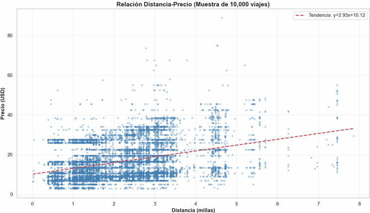
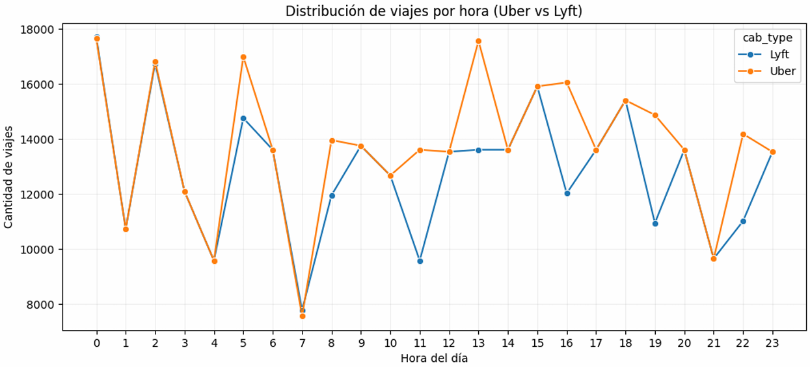
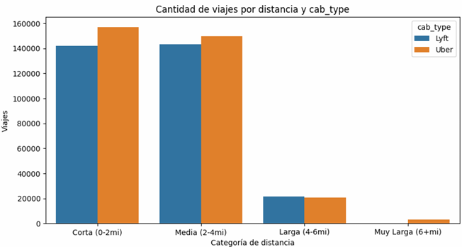
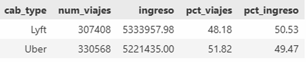
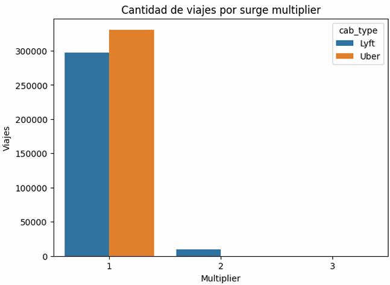
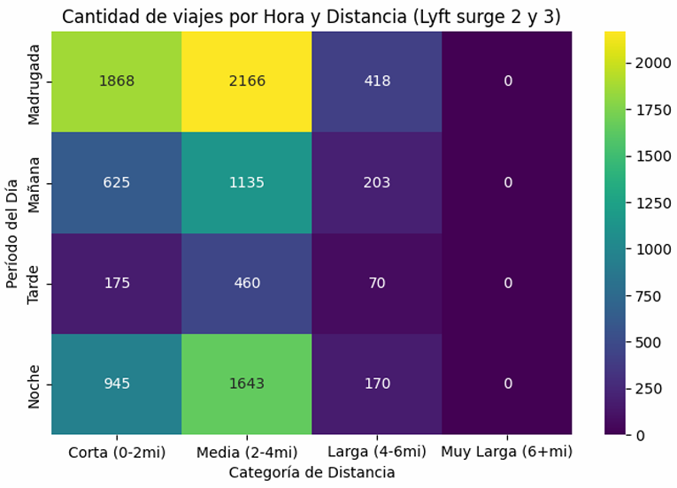
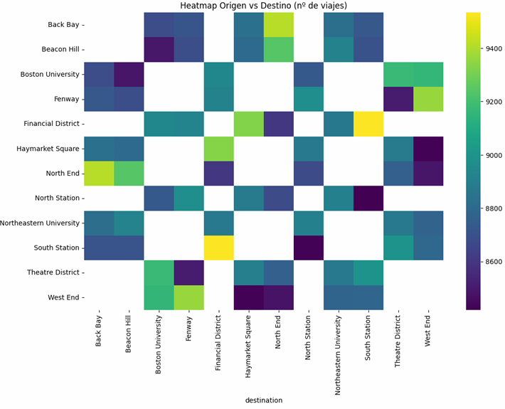

📊 Análisis Comparativo Uber vs Lyft — Data Science Project

Este proyecto realiza un análisis exhaustivo del comportamiento de viajes entre Uber y Lyft, utilizando técnicas de Exploratory Data Analysis (EDA), ingeniería de características y visualizaciones estadísticas.
El objetivo es identificar patrones de demanda, comportamiento tarifario y entender por qué Lyft genera más ingresos, aun cuando Uber registra más viajes.

Procesamiento y limpieza del dataset (rides_clean).

En análisis exploratorio del dataset se encontró que el servicio "taxi" de la empresa Uber tiene todos los registros de price nulos. Se procede a eliminar el 7.95% de registros sin precio ya que no se los puede rellenar con su mediana.

Creación de variables derivadas:

* Categoría de distancia.

* Categoría de hora (madrugada, mañana, tarde, noche).

* Día de la semana ordenado.

Análisis exploratorio:

* Distribución de distancias.

* Demanda temporal por hora, día y cab_type.

* Impacto del surge_multiplier en cada plataforma.

Comparación directa:
* Volumen de viajes.

* Ingresos totales.

* Efecto del precio dinámico (surge).

🔍 Hallazgos Clave
1. Uber domina en número de viajes

* Tiene más viajes totales en casi todas las categorías de distancia.

* En distancias cortas y medias la diferencia con Lyft es más marcada.

2. Lyft genera más ingresos que Uber

* A pesar de tener menos viajes, Lyft supera en ingresos gracias a tarifas más altas.

* Lyft es el único con surge_multiplier = 2 y 3.

* Cuando se compara solo viajes con surge = 1, Uber tendría más ingresos → el surge es el factor determinante.

3. Surge Multiplier de Lyft

* Los multiplicadores 2 y 3 se concentran en:

    * Madrugada

    * Horas de alta demanda puntual

* Este comportamiento incrementa el ingreso medio por viaje.

📈 Gráficos incluidos

Algunos gráficos generados en el proyecto:

Diagrama de dispersión de precio vs milla

Explicando que solo el 35% del precio se explica por distancia.

Distribución de viajes por hora entre las dos empresas

Uber domina en todas las horas a Lyft

Viajes por cab_type por categoria de distancia

Uber supera a Lyft en Viajes pero Lyft tiene mas ganancias.

Insight clave: Uber maneja una tarifa estandar mientras Lyft tiene multiplicadores por demanda.

Distancia vs Horario de viajes de Lyft cuando su multiplicador es 2 y 3, donde en la madrugada y a distancias de hasta 2 millas se concentran el mayor número de viajes

Rutas mas frecuentes

Conclusión: Lyft aprovecha el precio dinámico donde convierte pocos viajes de alto valor en más ingresos.

Proyecto desarrollado por Paul Zambrano y Rene Andrade.